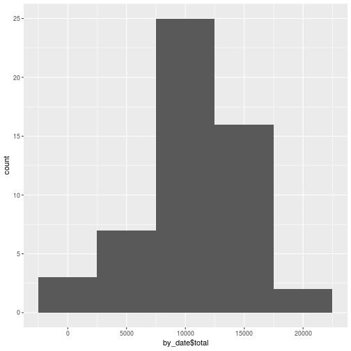

## Loading and preprocessing the data
The "activity.zip" that contains the data is included in the GIT repository. Unzip the file if needed.

```r
if (!file.exists("activity.csv")) {
    unzip("activity.zip")
}
```
Read the CSV file. Convert the data frame object to a dplyr data frame. Set the data types of the columns appropriately.

```r
d = read.csv("./activity.csv",
             header = TRUE,
             stringsAsFactors = FALSE)
library(dplyr)
d <- tbl_df(d)
d$steps <- as.numeric(d$steps)
d$date <- as.Date(d$date)
d$interval <- as.numeric(d$interval)
```

## What is mean total number of steps taken per day?
Summarise the data to average the total number of steps per day. 

```r
by_date <- d %>% na.omit() %>% 
    group_by(date) %>% 
    summarise(total=sum(steps))
```
Examine a histogram of the total number of steps taken each day. We are using the ggplot2 package for plotting in this report.

```r
library(ggplot2)
qplot(by_date$total,binwidth=5000)
```



## What is the average daily activity pattern?


## Imputing missing values


## Are there differences in activity patterns between weekdays and weekends?
